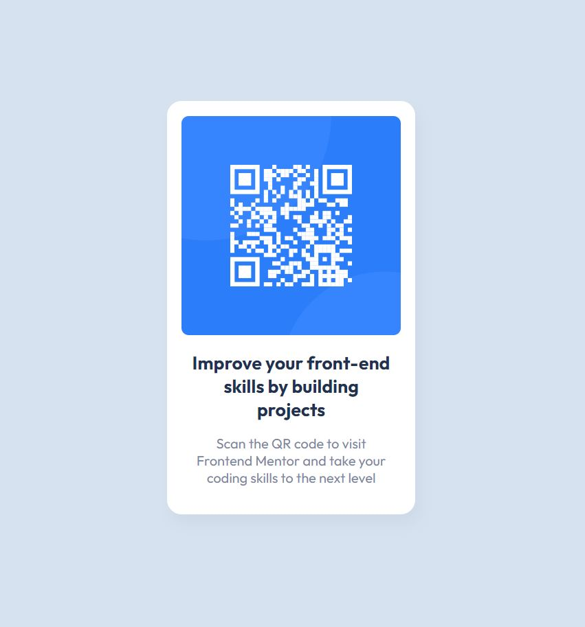

# Frontend Mentor - QR code component solution

This is a solution to the [QR code component challenge on Frontend Mentor](https://www.frontendmentor.io/challenges/qr-code-component-iux_sIO_H).

## Table of contents

- [Overview](#overview)
  - [Screenshot](#screenshot)
  - [Links](#links)
- [My process](#my-process)
  - [Built with](#built-with)
  - [What I learned](#what-i-learned)
  - [Continued development](#continued-development)
- [Author](#author)

## Overview

### Screenshot



### Links

- [Live Demo](https://aliaaz.github.io/qrcode/)

## My process

### Built with

- Semantic HTML5 markup
- CSS custom properties
- Mobile-first workflow

### What I learned

Experimented with clamp() and calc() and used them for the margin-block to keep the card vertically centered.

```css
.main {
  margin-block: clamp(3rem, calc((100vh - 29rem) / 2), 100em);
}
```

### Continued development

To work on how to make the CSS more robust and efficient.

## Author

- Github - [@aliaaz](https://github.com/aliaaz)
